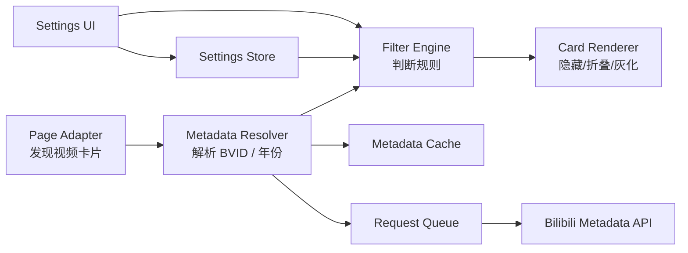

# Bilibili Year Filter — 设计方案包

> 目标：让 B 站网页版的视频卡片按 **实际发布时间年份** 过滤。
> 用户可以隐藏某一年、隐藏某个年份以前的视频，或只显示最近 N 年。

## 1. 核心结论

第一版优先做 **Tampermonkey 用户脚本**，验证真实页面兼容性和年份解析策略。
稳定后再封装为 **Chrome / Edge Manifest V3 扩展**。

不要把“过滤逻辑”和“B站网页结构”写死在一起。

最终系统分成四层：



## 2. 设计原则

1. **未知年份不隐藏**：解析失败时 fail-open，避免误删内容。
2. **页面结构可替换**：DOM 选择器全部放在 Page Adapter。
3. **元数据来源可替换**：API 只存在于 Metadata Provider。
4. **实际发布时间是唯一过滤事实**：不以标题年份、上传者文案等猜测。
5. **避免请求风暴**：缓存 + 队列 + 并发限制 + 退避。
6. **最小权限**：只访问 bilibili.com / api.bilibili.com，不读取登录凭据。
7. **过滤规则与表现分离**：规则决定 SHOW / HIDE / DIM / COLLAPSE，渲染层只执行。
8. **先验证后产品化**：Userscript 是实验载体，Extension 是最终产品载体。

## 3. 包内容

```text
bilibili-year-filter-design/
├── README.md
├── docs/
│   ├── 00-product-spec.md
│   ├── 01-architecture.md
│   ├── 02-component-contracts.md
│   ├── 03-data-model-and-rules.md
│   ├── 04-ui-ux.md
│   ├── 05-bilibili-adapters.md
│   ├── 06-reliability-security.md
│   ├── 07-test-plan.md
│   ├── 08-implementation-plan.md
│   ├── 09-acceptance-checklist.md
│   ├── 10-source-notes.md
│   └── 11-implementation-status.md
├── adr/
│   ├── ADR-001-userscript-first.md
│   ├── ADR-002-tiered-metadata-resolution.md
│   └── ADR-003-unknown-year-fail-open.md
├── starter/
│   ├── tampermonkey/bilibili-year-filter.user.js
│   └── extension/
│       ├── manifest.json
│       ├── popup.html
│       ├── popup.js
│       └── src/
│           ├── content.js
│           ├── adapters/
│           │   ├── bilibili-adapter.js
│           │   └── generic-card-adapter.js
│           └── core/
│               ├── date-parser.js
│               ├── filter-engine.js
│               ├── metadata-cache.js
│               ├── metadata-resolver.js
│               ├── renderer.js
│               ├── request-queue.js
│               ├── settings.js
│               └── storage.js
├── test/
│   ├── core.test.js
│   └── syntax-check.js
├── package.json
└── prompts/
    └── implementation-task.md
```

## 4. 推荐开发边界

### MVP

- 首页推荐
- 搜索结果
- UP 主空间视频列表
- 热门/排行榜类视频卡片
- 单独排除任意年份
- “隐藏 X 年以前”
- “只看最近 N 年”
- 隐藏 / 灰化 / 折叠
- 缓存发布日期
- 无限滚动 / SPA 导航可用

### 不进入 MVP

- APP
- 修改 B 站账号推荐算法
- 服务端代理
- 自动登录或 Cookie 抓取
- 弹幕、评论过滤
- 复杂关键词/UP 主联合过滤
- 跨设备云同步元数据缓存

## 5. 推荐验收标准

在支持页面连续滚动 10 分钟：

- 新出现卡片能自动处理；
- 同一 BVID 不重复发元数据请求；
- 解析失败不误隐藏；
- 修改年份规则后，已出现卡片即时重新计算；
- 页面 SPA 导航后无需刷新；
- B 站某一种卡片结构变化时，不影响 Filter Engine / Cache；
- API 暂时失败时页面本身仍可正常使用。

## License

本仓库整体使用 [MIT License](LICENSE) 授权。

该授权仅适用于本仓库中由项目作者或贡献者拥有相应权利的原创代码和文档；Bilibili 的商标、网站内容、接口数据及其他第三方材料不因本声明获得授权。

## 使用与发布

- [使用说明](使用说明.md)
- [release 发布流程](release/README.md)
