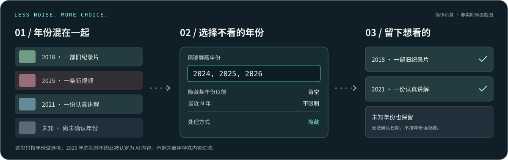

  

<h1 align="center">Bilibili Year Filter · B站年份屏蔽</h1>

<strong>把时间拨回去，把注意力拿回来。</strong>

隐藏不想看的年份，重新发现那些值得认真看的视频。

  
  
  
  
  

  <a href="https://raw.githubusercontent.com/zih19964-commits/bilibili-year-filter-design/master/starter/tampermonkey/bilibili-year-filter.user.js"><strong>安装用户脚本 ↗</strong></a>
  &nbsp; · &nbsp; <a href="#安装">安装浏览器扩展</a>
  &nbsp; · &nbsp; <a href="#找回旧视频">找回旧视频</a>
  &nbsp; · &nbsp; <a href="#使用说明">使用说明</a>
  &nbsp; · &nbsp; <a href="#当前边界">当前边界</a>

<picture><source media="(prefers-reduced-motion: reduce)" srcset="assets/brand/hero-static.svg"></picture>

## 好内容，不该被时间埋没

**还在为首页和搜索结果里的 AI 流水线视频烦躁？**

翻来覆去的合成配音、似曾相识的画面、看完却什么也没留下的内容。你只是想找一份认真做的教程、一部耐看的作品，或者一个真正有话想说的人。

**试试把时间拨回去。** 屏蔽你不想看的年份，给前人留下的精华视频重新留一个位置。把被廉价 AI 视频打断的审美和注意力，留给值得看的作品。

Bilibili Year Filter 不替你判断什么是好内容。它只把一个简单的选择还给你：**哪些年份，我不想看。**

> **按年份筛选，不做 AI 鉴定。** 新视频不等于 AI，旧视频也不必然优质。年份是你的筛选条件，不是内容质量的证明。

## 找回旧视频

例如，你想暂时不看 **2024、2025、2026** 年发布的视频：

| 设置项 | 填写内容 |
| --- | --- |
| 启用 | 开启 |
| 精确屏蔽年份 | `2024, 2025, 2026` |
| 隐藏某年份以前 | **留空** |
| 最近 N 年 | **不限制** |
| 处理方式 | 隐藏；担心错过内容可以先选灰化 |
| 特殊内容 | 先不勾选，避免把纪录片、课堂等一起过滤 |

这会过滤页面中已识别且命中这些年份的卡片，**不是主动搜回旧视频，也不会修改 B 站推荐算法**。年份未知的普通卡片保留。以后有新年份需要屏蔽，请手动补进列表。

**别选“最近 N 年”来找旧视频：它的作用正好相反，会过滤更早的内容。**

<picture><source media="(prefers-reduced-motion: reduce)" srcset="assets/brand/how-it-works-static.svg"></picture>

## 安装

**两种方式选一种，不要同时启用。** 都用于 B 站网页版，不适用于 B 站 App。

### 方式一 · Tampermonkey 用户脚本

1. 在 Chrome / Edge 安装 [Tampermonkey](https://www.tampermonkey.net/)。按其提示开启“允许用户脚本”或开发者模式，详见[官方说明](https://www.tampermonkey.net/faq.php?q=Q209)。
2. 打开[用户脚本安装链接](https://raw.githubusercontent.com/zih19964-commits/bilibili-year-filter-design/master/starter/tampermonkey/bilibili-year-filter.user.js)，在 Tampermonkey 安装页确认安装。
3. 没弹出安装页？打开[脚本源码](starter/tampermonkey/bilibili-year-filter.user.js)，复制**完整内容**；在 Tampermonkey 新建脚本，替换默认模板并保存。
4. 刷新 B 站网页，点击右下角的 **◷**，开始设置。

### 方式二 · Chrome / Edge 扩展

1. 在本仓库点击 **Code → Download ZIP**，下载并解压；也可以使用已有的本地仓库。
2. 在地址栏打开 `chrome://extensions` 或 `edge://extensions`，开启**开发者模式**。
3. 点击**加载已解压的扩展程序**，选择 **`starter/extension`** 文件夹，**不是仓库根目录，也不是 ZIP 文件**。
4. 刷新 B 站网页。可用右下角 **◷** 面板设置，也可点击浏览器工具栏里的扩展图标。

> 当前从扩展弹窗保存设置后，**请刷新已打开的 B 站页面**，确保载入新设置。页面右下角面板用于调整当前页面；不要把跨标签页同步当作已验收能力。

## 使用说明

### 每个开关做什么

| 选项 | 实际作用 |
| --- | --- |
| 精确屏蔽年份 | 多个年份用逗号或空格分隔，如 `2024, 2025, 2026`；不支持 `2024-2026` 这种区间写法 |
| 隐藏某年份以前 | 填 `2020` 会过滤 **2020 年之前**的内容，2020 年本身不受这一条影响 |
| 最近 N 年 | 按**自然年**计算，含当前年；例如 2026 年选最近 3 年，过滤 2024 年之前的内容，不是滚动 36 个月 |
| 隐藏 / 灰化 / 折叠 | 决定命中规则后的表现：移出列表、淡化显示或收起卡片 |
| 在卡片显示年份 | 给已解析的卡片显示年份，方便确认筛选依据 |
| 特殊内容 | 独立过滤娱乐类、番剧 / 漫画、课堂、广告；依赖结构化标记，不靠标题猜测 |
| 启用 / 恢复默认 | 暂停过滤，或恢复默认规则；恢复默认不主动清空元数据缓存 |

**多条规则叠加时，命中任意一条就会处理，不是取交集。**

年份未知时，**年份规则不隐藏**。但手动开启的特殊内容过滤是独立规则，即使年份未知，也可能因为广告、课堂等标记被处理。“娱乐类”还包含纪录片、电影、电视剧、国创和直播，勾选前请留意。

### 设置与生效

用户脚本和扩展的设置互相独立。用户脚本使用站点 `localStorage`，因此首页、搜索、UP 主空间等**不同子域的设置不共享**；需要分别设置。扩展使用 `chrome.storage.local`。

页面内面板调整后会重新计算当前已处理卡片；输入年份后离开输入框以触发变更。扩展弹窗使用“保存设置”。遇到页面没变化、换页后状态异常或卡片复用造成的旧状态，先刷新页面，再确认规则。

## 当前边界

**项目仍在开发中。能安装，不代表每类 B 站页面都已完成验收。**

| 范围 | 状态 |
| --- | --- |
| 首页推荐 | 仓库已有真实首页结构与确定性夹具的验收记录 |
| 搜索、UP 主空间、热门 / 相关推荐 | 已有适配代码，仍需逐页兼容性验收；不要视为全面验证通过 |
| 无限滚动、页面内跳转 | 已有处理逻辑；DOM 复用、设置同步等场景仍有兼容性限制 |
| B 站 App、评论、弹幕、账号推荐模型 | 不属于本工具处理范围 |

日期无法确认、接口失败或页面结构不匹配时，普通卡片会保留。新出现的卡片也可能先显示，再完成解析和过滤；**不承诺零闪烁、即时处理或完全屏蔽**。

原有验证范围见 [实现状态](docs/11-implementation-status.md)。这里的宣传插画是规则示意，**不是实测截图，不是效果保证**。

## 隐私与权限

不需要额外账号或自建后端。设置与缓存保存在浏览器本地，但**不等于完全离线**：必要时会向 B 站元数据接口查询视频发布时间。

扩展声明 `storage` 与 B 站页面 / API 的站点权限，不申请 `cookies`、`history`、`tabs` 权限；用户脚本声明 `@grant none`。实际权限以 [manifest.json](starter/extension/manifest.json) 和[脚本头部](starter/tampermonkey/bilibili-year-filter.user.js)为准，不要把本地存储理解为与网页脚本完全隔离。

## 常见问题

<strong>装好了，但没有右下角按钮？</strong>

确认脚本已启用、Tampermonkey 已获准执行用户脚本；扩展方式确认加载的是 `starter/extension` 且管理页没有错误。关闭重复安装的另一种版本，再刷新受支持的 B 站网页。

<strong>为什么有些新视频还在？</strong>

可能未命中你的年份、日期尚未确认，或卡片结构尚不支持。先开启年份标记核对；本工具不通过标题或画面识别 AI，也不会把日期未知当作屏蔽理由。

<strong>如何更新、暂停和卸载？</strong>

更新用户脚本时重新安装最新源码；更新解压扩展时，在扩展管理页点击“重新加载”，再刷新 B 站网页。临时暂停可取消“启用”，状态残留时刷新页面；彻底停用可在 Tampermonkey 或浏览器扩展管理页删除。用户脚本的站点缓存可能仍保留，按需清理本项目的存储键，避免清空整个站点数据影响登录。

<strong>页面改版后失效、卡顿或出现异常？</strong>

先停用过滤并刷新，确认是否由本工具引起。反馈时提供页面类型、复现步骤、浏览器版本和脱敏截图。不要上传 Cookie、令牌或带隐私信息的完整接口响应。

## 开发与设计

架构与详细规格继续保留在文档中，README 优先服务安装和使用。

[产品规格](docs/00-product-spec.md) · [系统架构](docs/01-architecture.md) · [规则模型](docs/03-data-model-and-rules.md) · [测试计划](docs/07-test-plan.md) · [实现状态](docs/11-implementation-status.md) · [视觉资源说明](docs/12-visual-identity.md) · [发布流程](release/README.md)

采用 [MIT License](LICENSE)。Bilibili 商标、网站内容、接口数据与其他第三方材料不因本许可证获得授权；本项目与 Bilibili 官方无隶属关系。

---

<strong>不是所有新内容都值得看。也不是所有旧内容都该被忘记。</strong>

把选择权，留给自己。

