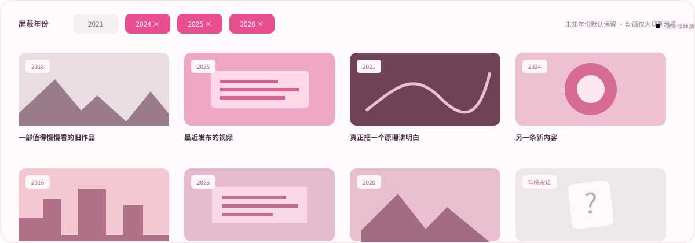

<!-- 融合 A：白底海报。把本 README.md 与 assets/byf-fusion-a/ 合并到仓库根目录。 -->
<p align="center">
  
</p>

<h1 align="center">Bilibili Year Filter · B站年份屏蔽</h1>

<p align="center"><strong>把时间拨回去，把注意力拿回来。</strong></p>
<p align="center">隐藏不想看的年份，给认真创作留一个位置。</p>

<p align="center">
  <a href="#安装"></a>
  <a href="#安装"></a>
  <a href="#常见问题"></a>
  <a href="LICENSE"></a>
</p>

<p align="center">
  <a href="https://raw.githubusercontent.com/zih19964-commits/bilibili-year-filter-design/master/starter/tampermonkey/bilibili-year-filter.user.js"><strong>安装用户脚本 ↗</strong></a>
  &nbsp; · &nbsp; <a href="#安装">安装浏览器扩展</a>
  &nbsp; · &nbsp; <a href="#找回旧视频">找回旧视频</a>
  &nbsp; · &nbsp; <a href="#使用说明">使用说明</a>
</p>

<p align="center"><a href="#安装"></a></p>

## 好内容，不该被淹没

**受够了首页和搜索结果里的 AI 流水线？**

你只是想看一份讲明白的教程、一部耐看的作品，或者一个真正有话想说的人。

试试屏蔽不想看的年份，给认真创作留一个位置。**找回前人留下的精华，也找回自己的审美和注意力。**

Bilibili Year Filter 不替你定义什么是好内容，只把一个简单的选择还给你：**哪些年份，我不想看。**

> **按年份筛选，不做 AI 鉴定。** 年份是你的筛选条件，不是内容质量的证明。

<p align="center"></p>

## 看看筛选的样子

点选年份后，匹配卡片可隐藏、灰化或折叠，未知年份的普通卡片保留。

<p align="center"></p>

*上图是本地交互原型的示例演示，不是真实 B 站录屏；快捷演示按钮不代表插件已有对应预设。*


## 安装

**用户脚本和浏览器扩展，选一种即可，不要同时启用。** 用于 B 站电脑网页版，不适用于 App。

### Tampermonkey 用户脚本

1. 在 Chrome / Edge 安装 [Tampermonkey](https://www.tampermonkey.net/)，按管理器提示允许执行用户脚本。
2. 打开[用户脚本安装链接](https://raw.githubusercontent.com/zih19964-commits/bilibili-year-filter-design/master/starter/tampermonkey/bilibili-year-filter.user.js)，确认安装。
3. 没有弹出安装页？复制[脚本完整源码](starter/tampermonkey/bilibili-year-filter.user.js)，在 Tampermonkey 新建脚本、替换默认模板并保存。
4. 刷新 B 站页面，点击右下角 **◷** 打开设置。

### Chrome / Edge 扩展

1. 在本仓库点击 **Code → Download ZIP**，解压下载文件。
2. 打开 `chrome://extensions` 或 `edge://extensions`，开启**开发者模式**。
3. 点击**加载已解压的扩展程序**，选择 **`starter/extension`**，不是仓库根目录或 ZIP 文件。
4. 刷新 B 站页面，通过右下角 **◷** 或浏览器工具栏扩展图标设置。

从扩展弹窗保存后，刷新已经打开的 B 站页面，确保加载新设置。

## 找回旧视频

例如，暂时不看 **2024、2025、2026** 年发布的视频：

```text
精确屏蔽年份       2024, 2025, 2026
隐藏某年份以前     留空
最近 N 年          不限制
处理方式           隐藏（也可先用灰化）
特殊内容           先不勾选
```

**不要用“最近 N 年”来找旧视频：它会过滤更早的内容，作用正好相反。** 示例是精确年份列表，不会随新年自动增加年份，也不是插件内置的“回到过去”按钮。

## 使用说明

| 设置 | 作用 |
| --- | --- |
| 精确屏蔽年份 | 用逗号或空格分隔，如 `2024, 2025`；不使用 `2024-2026` 区间写法 |
| 隐藏某年份以前 | 填 `2020`，过滤 2020 年之前的视频；这一条不包含 2020 年 |
| 最近 N 年 | 按自然年计算，包含当前年；例如 2026 年选近 3 年，会过滤 2024 年之前的视频 |
| 隐藏 / 灰化 / 折叠 | 决定匹配卡片如何显示，不改变年份判定 |
| 显示年份 | 为已解析的视频卡片显示年份标记，便于核对 |
| 特殊内容 | 独立按结构化标记过滤娱乐类、番剧 / 漫画、课堂、广告，不靠标题猜测 |
| 启用 / 恢复默认 | 暂停过滤，或恢复默认规则；恢复默认不主动清空元数据缓存 |

多条年份规则**命中任意一条即处理**。普通卡片年份未知时不按年份隐藏；开启特殊内容过滤后，仍可能因广告等结构化标记被处理。

“娱乐类”包含纪录片、电影、电视剧、国创和直播，寻找这些旧作品时先不要勾选。页面内面板输入后离开输入框，触发当前页面重新计算；跨标签页更新不要当作已验收能力。

## 常见问题

<details>
<summary><strong>它能识别 AI 视频、自动找回旧作品吗？</strong></summary>

不能。它按实际发布时间年份筛选已发现的网页卡片，不分析创作方式，不主动检索旧视频，也不修改 B 站推荐算法。新视频不等于 AI，旧视频也不必然优质。

</details>

<details>
<summary><strong>为什么有些视频没有消失？</strong></summary>

可能没有命中规则、日期尚未确认，或卡片结构尚不支持。先开启年份标记核对；页面改版或状态异常时可刷新。未知年份保留，不承诺所有卡片都能解析或完全无闪烁。

</details>

<details>
<summary><strong>设置存在哪？如何更新和卸载？</strong></summary>

设置和缓存保存在浏览器本地，必要时仍会请求 B 站元数据接口，并非完全离线。用户脚本按站点子域分别保存；脚本版与扩展版设置互不共享。

更新脚本时重新安装最新源码；更新解压扩展后，在扩展管理页重新加载，再刷新 B 站。暂停可取消“启用”；卸载在 Tampermonkey 或扩展管理页操作。脚本本地缓存可能保留，清理时避免删除整个站点数据影响登录。

</details>

## 适配与权限

现有[实现状态](docs/11-implementation-status.md)记录了首页结构和确定性夹具的验证；搜索、UP 主空间、热门等页面仍需分别确认兼容性，不把已有适配代码视为全面验收通过。

扩展权限以 [manifest.json](starter/extension/manifest.json) 为准；已有实现声明 `storage` 与 B 站页面 / API 的站点权限。用户脚本声明 `@grant none`。反馈异常时不要上传 Cookie、令牌或其他隐私数据。

[产品规格](docs/00-product-spec.md) · [架构](docs/01-architecture.md) · [规则模型](docs/03-data-model-and-rules.md) · [实现状态](docs/11-implementation-status.md) · [发布流程](release/README.md)

## 许可证

采用 [MIT License](LICENSE)。Bilibili 商标、网站内容、接口数据及其他第三方材料不因本许可证获得授权；本项目与 Bilibili 官方无隶属关系。

---

<p align="center"><strong>让值得看的，再被看见。</strong><br>把选择权，留给自己。</p>
