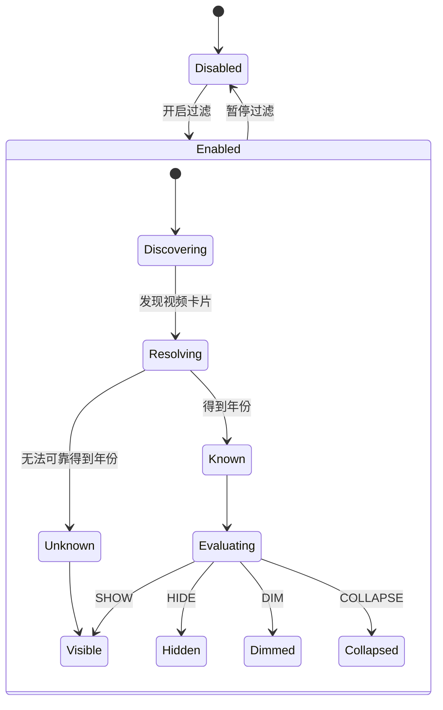

# 00 — Product Spec

## 1. 问题定义

B 站的首页、搜索、UP 主空间等页面混合展示不同年代的视频。
用户希望主动排除某些年份，而不是让推荐算法决定。

真正需要解决的问题不是：

> “看到日期后手动隐藏。”

而是：

> “建立一个独立于 B 站推荐系统的客户端时间过滤层。”

## 2. 用户目标

用户能够：

- 屏蔽一个或多个具体年份；
- 屏蔽某年份以前的全部视频；
- 只看最近 N 年的视频；
- 暂时关闭过滤；
- 在不刷新页面的情况下改变规则；
- 明确知道某个视频为什么被隐藏；
- 在年份未知时仍看到视频，而不是误过滤。

## 3. 核心用户故事

### US-01 指定年份排除

给定：

```text
屏蔽年份 = {2019, 2020, 2021}
```

则发布日期属于上述年份的视频卡片不显示。

### US-02 年份阈值

```text
隐藏 2022 年以前
```

语义：

```text
pubYear < 2022 => HIDE
```

### US-03 最近 N 年

假设当前年为 `Y`，用户选择最近 3 年：

```text
pubYear >= Y - 2 => SHOW
其他 => HIDE
```

当前年份必须从浏览器本地时间动态计算，不能写死。

### US-04 年份未知

无法可靠确认年份：

```text
UNKNOWN => SHOW
```

并允许调试模式给卡片标记：

```text
年份未知
```

## 4. 非功能要求

### 性能

- MutationObserver 回调不得对整页无限扫描；
- 单 BVID 正常情况下只解析一次；
- API 请求必须有队列；
- 请求失败有指数退避；
- 正元数据缓存长期保存；
- 卡片重复出现时复用缓存。

### 稳定性

- DOM 改版影响限定在 adapter；
- API 变化影响限定在 provider；
- 规则变化不需要重新请求元数据；
- UI 故障不能阻塞页面浏览。

### 隐私

插件无需读取：

- 密码；
- 登录 Cookie；
- 观看历史；
- 收藏夹；
- 用户身份信息。

## 5. 产品状态机



## 6. 成功指标

功能是否成功，不看“代码是否运行”，而看：

1. 过滤结果是否基于真实发布时间；
2. 是否不会因为网络/API失败误隐藏；
3. 是否能应对 B 站动态加载；
4. 是否不会造成明显页面卡顿；
5. 是否能在 B 站局部改版后以最小代价修复。
