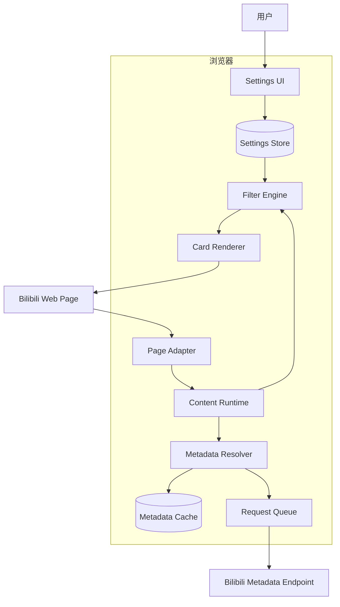
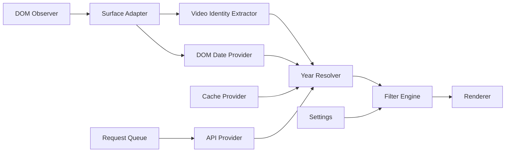
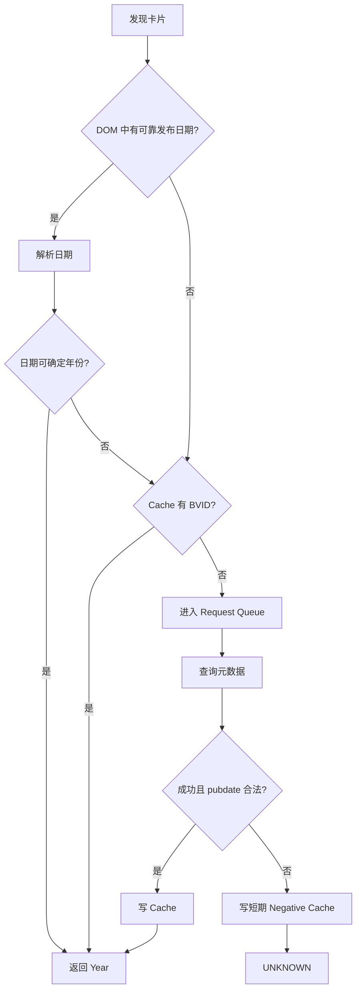
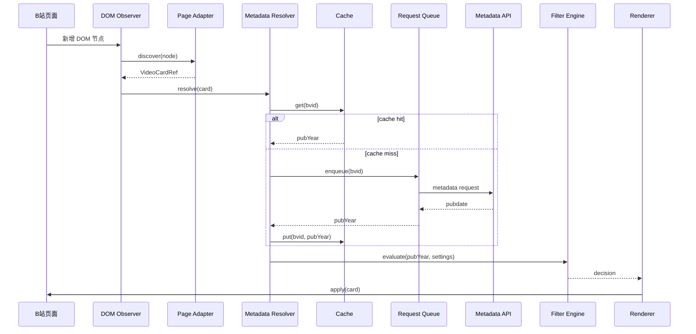

# 01 — Architecture

## 1. C4 Container 级架构



## 2. Component 级职责



## 3. 为什么这样拆

### Page Adapter

唯一知道“B站某个页面的视频卡片长什么样”。

禁止它：

- 决定过滤规则；
- 管理缓存；
- 自己请求 API。

### Metadata Resolver

负责回答：

```text
这个 BVID 的可靠发布时间年份是什么？
```

不负责：

- 卡片隐藏；
- UI；
- 页面 DOM。

### Filter Engine

纯函数：

```text
(year, settings) -> decision
```

因此可以完全脱离 B 站做单元测试。

### Renderer

只执行：

```text
SHOW / HIDE / DIM / COLLAPSE
```

不参与业务判断。

## 4. 元数据解析顺序



优先级的本质：

```text
低成本事实 > 已缓存事实 > 网络事实 > UNKNOWN
```

## 5. 卡片处理时序



## 6. 边界

```text
核心域：
  YearResolver
  FilterEngine
  RuleModel

平台层：
  Storage
  RequestQueue
  Logger

B站适配层：
  URL识别
  卡片识别
  BVID提取
  DOM日期提取
  Metadata API

表现层：
  设置面板
  卡片渲染
```

其中最重要的隔离线：

```text
B站会变化的东西
──────────────
Page Adapter / API Provider

自己控制的稳定逻辑
──────────────
Filter Engine / Rule Model / Cache Contract
```
